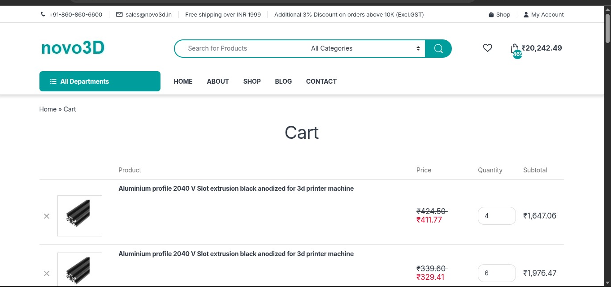

---
#### Total Time Spent : 77hr
---

## June 12th-14th  : Start design on pen and paper 
#### I designed the overview and basic functionality of the project on pen and paper. This includes all features to be included such as rigid frame , fast and high quality, and error handling features.For this i look on internet about top features and other cool things about 3d printers and then decided to add these in my 3d printer :
- Core-XY
- Linear Rails
- Klipper compatible
- 310\*310\*310 Bed size
- Dual Z-Axis
- Bowden Extruder
- Octopus v1.1
- Robust frame

*Total Time Spent =12hr*
---
---
## June 14-17th  : Research about all parts and plan what to choose 
#### I researched alot about all parts in a 3d printer choose the best ones for my 3d printer under the budget for this i web surf 3 or 4 websites for 3d printer parts.The parts i choose are :
- 2020,2040,4040 frame
- MGN-12 linear rails
- V6 hotend
- Nema 17 motors
- Octopus v1.1
- 8mm Lead Screws

*Total Time Spent=14hr*
---
---
## June 17-19th  : Made the Top Gantory and Custom Parts
#### I explored many top gantory designs for Core-XY builds with MGN-12 and I find Core-XY Frame V2.0 matches the most with my requirements but this is not fuly compatible so i have to edit all the parts to fit on 2040 frame and also made a custom extruder holder along with some more tweaks to make the frame more stable and robust.The changes i made :
- Adapt the build to be compatible with 2040 frame
- Made a custom extruder holder
- Make parts more robust and strong

*Total Time Spent=15hr*
---
---
## June 19-21th : Find and Add Cad models for parts for Assembly
#### I import all the Cad models for the parts to be used in builds and edit some for proper length and also make some more custom parts.For this i explore the GrabCad and Thingiverse for models ,for custom parts I search for there dimensions and make there CAD models. 
####Parts imported include :
- Alumminium extrusions
- Brackets
- Motors
- Extruder and Hotend
- Mounts and Joints

*Total Time Spent=13hr*
---
---
## June 21-23th : Assembled the full build on Onshape Assembly
#### I gathered 3d models of all parts and then make sub assemblies for them and then merge all sub-assemblies to make a final assembly and then allign them properly.I took a lot of patience and focus to allign those tiny screws properly at place.

*Total Time Spent=17hr*
---
---
## June 21-23th : Finalize the build with some tweaks and Upload it to web
#### I made a proper github repo and also uploaded the build to Grab-Cad and Thangs.After this i made a proper BOM for my repo.
#### Tasks completed :
- Make a Proper Repo
- Upload on Web
- Documentation

*Total Time Spent=6hr*

