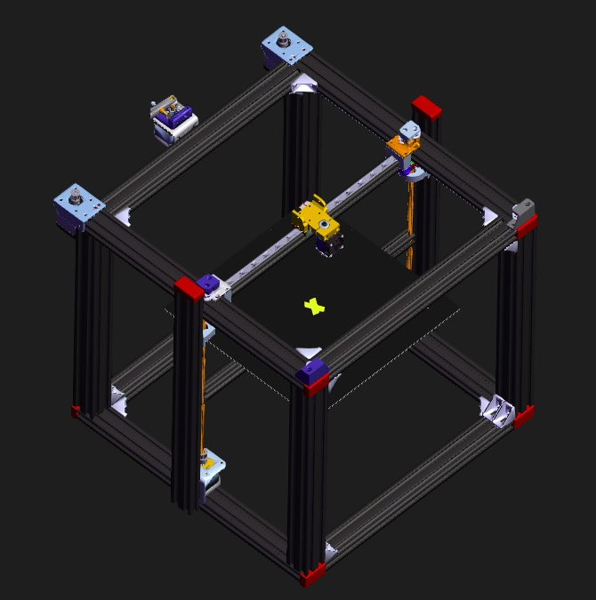
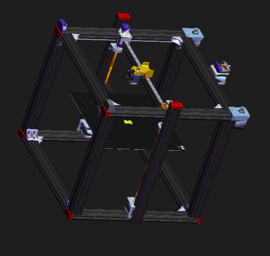
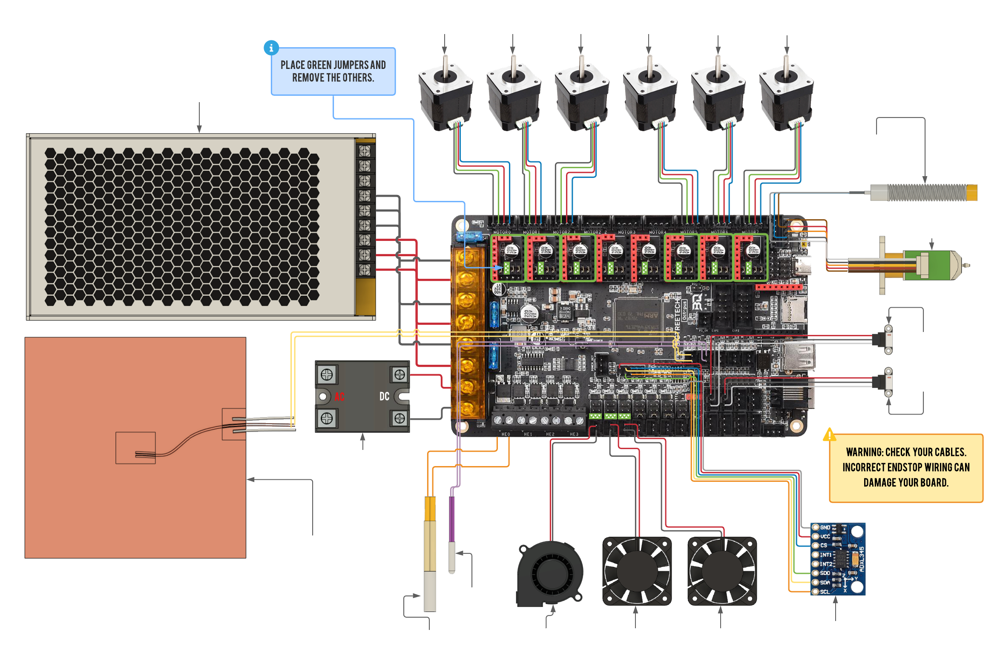

# SMXY-3D
SMXY-3D is a high-performance, CoreXY-based 3D printer designed for speed, precision, and modularity perfect for who demand professional results at an affordable cost. Built with a rigid aluminum frame and advanced motion system, it's optimized for Klipper, input shaping, and future upgrades.

# Features :
- CoreXY Architecture
- Large Build Volume of up to 310×310×310 mm
- Dual Z-axis
- Klipper Compatibility
- Speed upto 450mm/s
- High Quality prints
- Rigid Frame with Linear Rails

# Purpose :
I made this 3d printer to make a cheap diy high end printer with high speed and good quality.So, anyone can experience high-end printers in Pocket-friendly price and if want something extra and less they can do it and if anything breaks they easily replace and buy it.

# 3d Model :
Visit this web to view it in 3d : 
<a href="https://grabcad.com/library/smxy-3d-1" > **View** </a>

# Images :
**3D Model :**

  
  

  
  

**Wiring :**
This is general wiring for all components .

  

# BOM:
| Category              | Qty | Item                          | Unit Price (USD) | Total Price (USD) |
|-----------------------|-----|-------------------------------|------------------|-------------------|
| Frame & Structure     | 4   | 4040 Aluminum Extrusion       | ~$2.6            | $10.4             |
| Frame & Structure     | 4   | 2040 Aluminum Extrusion       | ~$1.5            | $6.0              |
| Frame & Structure     | 8   | 2040 Aluminum Extrusion (alt) | ~$1.5            | $12.0             |
| Frame & Structure     | 1   | 2020 Aluminum Extrusion       | ~$1.2            | $1.2              |
| Frame & Structure     | 44  | Profile Connector             | ~$0.3            | $13.2             |
| Frame & Structure     | 8   | Endcap for 2040               | ~$0.15           | $1.2              |
| Fasteners & Screws    | 40  | T‑Nuts                        | ~$0.05           | $2.0              |
| Fasteners & Screws    | —   | Various Screws & Washers      | ~$0.03–$0.05     | ~$1.9             |
| Fasteners & Screws    | 8   | Nuts                          | ~$0.02           | $0.16             |
| Motion System         | 3   | MGN12H Linear Rails 0.5 m     | $28.0            | $84.0             |
| Motion System         | 4   | NEMA 17 Stepper Motors        | $8.2             | Already owned             |
| Motion System         | 8   | GT2 Idler Pulleys             | $0.38            | $3.0              |
| Motion System         | 1   | GT2 Timing Belt               | $0.38            | $0.4              |
| Z‑Axis & Bed          | 2   | Lead Screw Rods               | ~$3              | $6.0              |
| Z‑Axis & Bed          | 8   | Rod Mounts, Nuts, Bearings... | ~$0.5–$1 each    | ~$12.0            |
| Z‑Axis & Bed          | 4   | Bed Plate                     | ~$10             | $40.0             |
| Z‑Axis & Bed          | 1   | Heated Bed                    | ~$25             | $25.0             |
| Extruder & Print Head | 1   | Extruder Kit + V6 Hotend      | ~$15 + $10       | $25.0             |
| PSU                   | 1   | 12 V 30 A PSU                 | ~$20             | Already owned      |
| Main Board            | 1   | Octopus V1.1                  | $50.0            | $50.0             |
| Main Board            | 5   | TMC2209 Drivers               | $7.0             | $35.0             |
| Main Board            | 1   | RPi 3 (1 GB) + TFT Display    | $35 + $9         | $44.0             |
| **Totals**            | —   | —                             | —                | **≈ $350**         |
